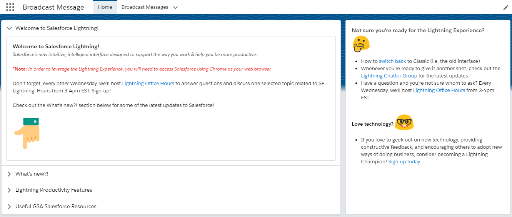

# Broadcast Message

## Description

Broadcast Message is a simple Lightning Component and object that allows application owners and stakeholders to update content on pages and utility bars without the need for constant engagement with Salesforce Admins.

## Dependencies

* [Apache ANT](https://ant.apache.org/) 
* [ant-salesforce.jar](https://developer.salesforce.com/docs/atlas.en-us.daas.meta/daas/forcemigrationtool_install.htm)
* Salesforce Lightning, this app does not work in Classic

## Installation

1. Configure the `build.properties` file to point at a target sandbox org
1. `ant deployCode`
1. Assign either the Admin or Creator permission set to current user
1. Assign ViewAll permissions on the Broadcast Message object for all internal profiles. This will ensure that all users can view any content that gets posted.

## Usage

* Navigate to the Broadcast Message app
* Create new record
* Enter "Hello World!" in the Content Message field
* Check the Active checkbox
* Save
* Copy the record ID from the URL
* Navigate to a page where the content should be displayed
* Click the cog wheel then Edit Page
* From the Lightning Components panel on the left, drag the Broadcast Message component into the desired location.
* Paste the record ID into the component configuration pane
* Save
* Navigate back to the parent page and the content should display

### Best Practices

The default layout for Broadcast Message records contains three columns. Place an instance of the Broadcast Message component into the left most column and have it serve as help text for users. 

## Contributing

See, [Contributing](/CONTRIBUTING.md)

## License

See, [License](/LICENSE.md)

## Questions

If you have questions, please feel free to contact us:

* Open an issue

This repository uses a [GSA Github template](https://github.com/GSA/code-gov-repo-template) which makes open sourcing code easier!
